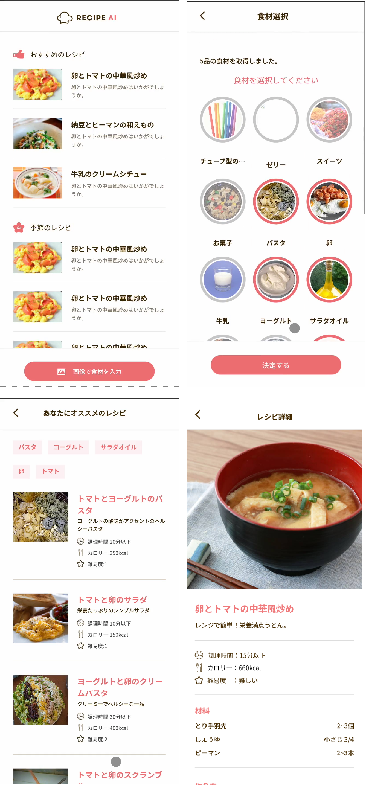

<p align="center">
    <br />
    <strong align="center">今晩の料理は何にしますか？ RECIPE AI ならあなたの冷蔵庫の写真から最適なレシピを提案いたします。</strong><br />
    <p align="center">HPチーム春合宿2024年 グループ3 作品</p>
</p>
<p align="center">
  
  
  
</p>

## アプリの特徴

- **冷蔵庫内の写真から食材を検出する**
- **レシピの提案**
  - 最適なレシピを提案します。その他にも「料理時間」や「難易度」、「カロリー」などの情報もすぐに確認できます。
- **レシピの詳細**

## スクリーンショット



## 拡張機能

- Volar
- Prettier - Code formatter

## セットアップ

1. `.env.sample`をコピーして、`.env.local`として保存する。
2. `VITE_OPENAI_KEY=`にOpenAIのキーを入力する。

3. パッケージのインストール

```bash
npm install
```

## 実行

```bash
npm run dev
```
